# ESQUELETO PARA APLICAÇÕES DO IFCE - CAMPUS SOBRAL

Aplicação skeleton pronta para fork com autenticação LDAP/AD integrada, sistema de controle de acesso baseado em papéis (RBAC), logging de atividades e módulo de FAQ. Uma base sólida para construir aplicações web modernas no IFCE - Campus Sobral.

## STACK DE TECNOLOGIAS

### Backend
- **Laravel 13** - Framework PHP robusto
- **Laravel Sanctum** - Autenticação com tokens API
- **Inertia.js v3** - Adaptador para React no Laravel
- **Spatie Activity Log** - Registro e auditoria de ações
- **Ziggy** - Helpers de rotas disponíveis em JavaScript
- **Laravel Pint** - Padronização de código PHP
- **Laravel Sail** - Ambiente Docker pré-configurado
- **Laravel Pail** - Visualização de logs em tempo real
- **LdapRecord** - Integração com Active Directory/LDAP

### Frontend
- **React 19** - Biblioteca para interfaces declarativas
- **Tailwind CSS v4** - Framework de CSS utilitário
- **Headless UI** - Componentes UI sem estilos
- **TipTap** - Editor de texto rico (Rich WYSIWYG)
- **Lucide React** - Ícones SVG reutilizáveis
- **Tailwind Merge** - Tratamento inteligente de classes Tailwind
- **Vite** - Bundler e dev server de última geração

### Banco de Dados
- **MariaDB 11** - Servidor de banco de dados (via Sail)
- **Redis** - Cache e filas (via Sail)

## FUNCIONALIDADES PRINCIPAIS

### 🔐 Autenticação e Segurança
- Login via **Active Directory (LDAP)** do IFCE — autenticação com matrícula e senha institucional
- Validação de senha via bind LDAP direto (sem necessidade de conta de serviço)
- Fallback para senha bcrypt local (admins locais)
- Usuários precisam estar cadastrados previamente no banco local para acessar
- Redirecionamento de recuperação de senha para o **SUAP** (`suap.ifce.edu.br`)
- Gerenciamento de sessões
- Autenticação baseada em tokens com Laravel Sanctum

### 👥 Sistema RBAC (Role-Based Access Control)
- **Usuários** - Criação, edição, exclusão e gerenciamento de usuários
- **Permissões** - Conjunto nomeado de regras (ex: Administrador, Colaborador)
- **Regras** - Controles granulares (ex: users.viewAny, users.create)
- **Grupos** - Organização lógica de regras
- Autorização automática via Gates do Laravel
- Sincronização de autorizações para o frontend via Inertia

### 📝 Módulo FAQ
- Gerenciamento completo de perguntas frequentes (CRUD)
- Sistema de tags para organização
- Página pública de visualização de FAQs
- Filtro e busca de FAQs

### 📊 Dashboard Administrativa
- Interface intuitiva e responsiva
- Widgets informativos
- Sidebar com navegação contextual
- Integração de componentes reutilizáveis

### 📋 Auditoria e Logging
- Registro automático de ações dos usuários
- Rastreamento de alterações em registros sensíveis
- Histórico de atividades consultável
- Log estruturado com timestamps

### 📱 Página Pública
- Landing page welcomingque apresenta a aplicação
- Visualização de FAQs sem autenticação
- Design responsivo e moderno

## INSTALAÇÃO

### Pré-requisitos
- Docker e Docker Compose (ou Docker Desktop)
- Git
- Portas 80 e 3000 disponíveis

### Passo a Passo

#### 1. Clonar o repositório
```sh
git clone https://github.com/CTI-Sobral-IFCE/skeleton.git meu-projeto
cd meu-projeto
```

#### 2. Remover repositório original e adicionar seu repositório
```sh
git remote remove origin
git remote add origin https://github.com/USER/REPO.git
```

#### 3. Configurar variáveis de ambiente
```sh
cp .env.example .env
```

Edite o arquivo `.env` com as configurações do seu projeto (nome da aplicação, URL, banco de dados, etc).

#### 4. Instalar dependências PHP
```sh
# Com Composer instalado
composer install

# Ou com Docker
docker run --rm \
    -u "$(id -u):$(id -g)" \
    -v "$(pwd):/var/www/html" \
    -w /var/www/html \
    laravelsail/php83-composer:latest \
    composer install --ignore-platform-reqs
```

#### 5. Configurar alias do Sail (opcional, recomendado)
Adicione ao seu `.bashrc` ou `.zshrc`:
```sh
alias sail='[ -f sail ] && bash sail || bash vendor/bin/sail'
```

#### 6. Instalar dependências JavaScript
```sh
sail npm install
```

#### 7. Gerar chave de segurança
```sh
sail artisan key:generate
```

#### 8. Executar migrations e seeders
```sh
sail artisan migrate:fresh --seed
```

#### 9. Iniciar o servidor de desenvolvimento
```sh
# Opção 1: Iniciar tudo de uma vez (recomendado)
sail composer run dev

# Opção 2: Iniciar em terminais separados
sail up -d                    # Inicia containers Docker
sail npm run dev              # Inicia dev server Vite
sail artisan queue:listen     # Inicia worker de filas
sail artisan pail             # Visualiza logs em tempo real
```

### Acessar a Aplicação

| Tipo | URL |
|------|-----|
| **Página Pública** | http://localhost |
| **Dashboard Admin** | http://localhost/admin |
| **Credenciais Padrão (admin local)** | Matrícula: `sua matrícula` |
| | Senha: `sua senha SUAP/E-mail institucional` |


## COMANDOS ÚTEIS

### Desenvolvimento
```sh
# Inicia containers Docker em background
sail up -d
# Inicia containers em foreground
sail up

# Inicia Vite dev server
sail npm run dev 
```

O sistema está distribuído em duas partes do front-end.

* Página de acesso público
  * <http://url-do-app>
* Dashboard
  * <http://url-do-app/admin>

Para acessar a dashboard:

**Login LDAP:** use sua **matrícula institucional** do IFCE e senha do SUAP/AD.
**Login local:** use a matrícula do admin local (`1000000`) com senha `qwe123`.

> A recuperação de senha é feita exclusivamente pelo [SUAP](https://suap.ifce.edu.br/comum/solicitar_trocar_senha/).

### TELAS

#### Página Inicial

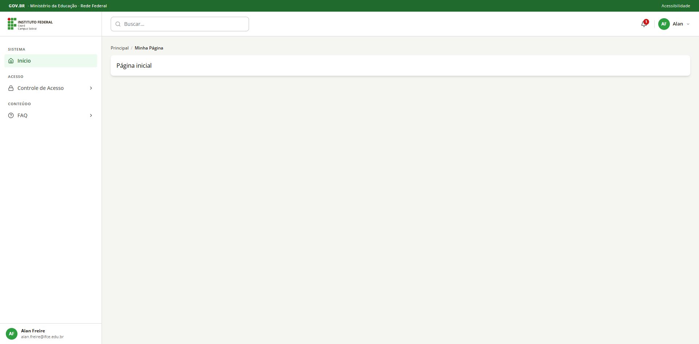

#### 📋 Gerenciamento de Notificações

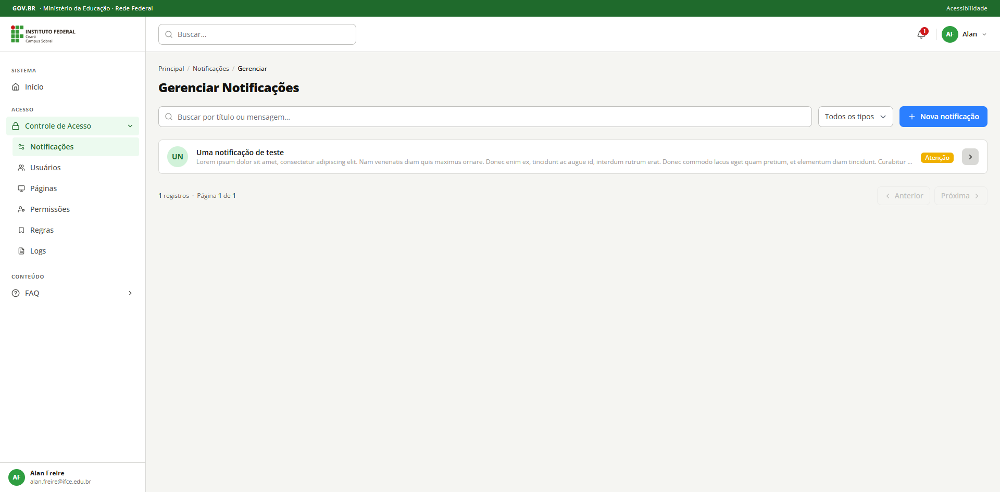

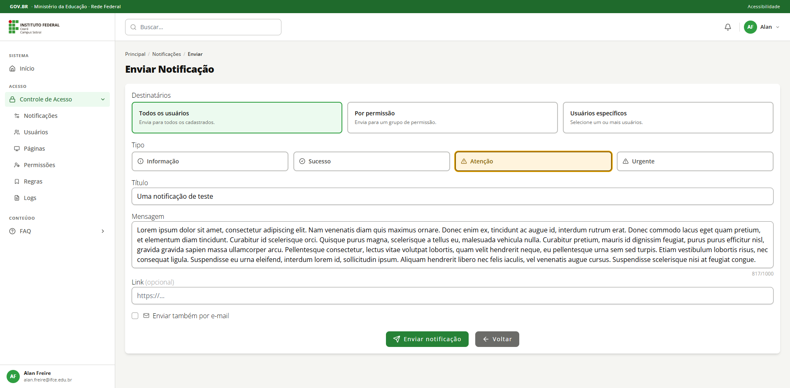

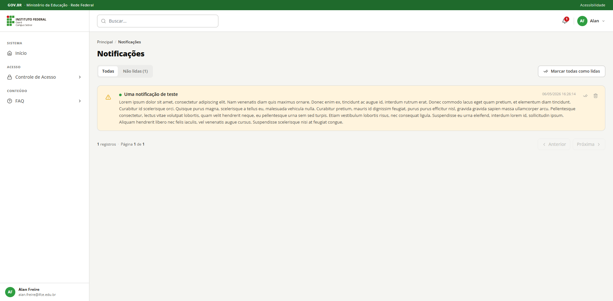

#### 👥 Gerenciamento de Usuários

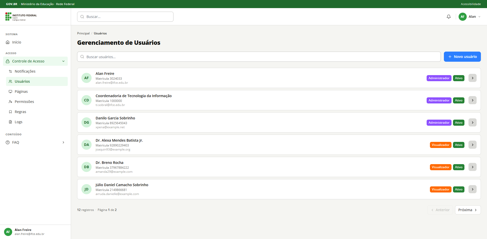

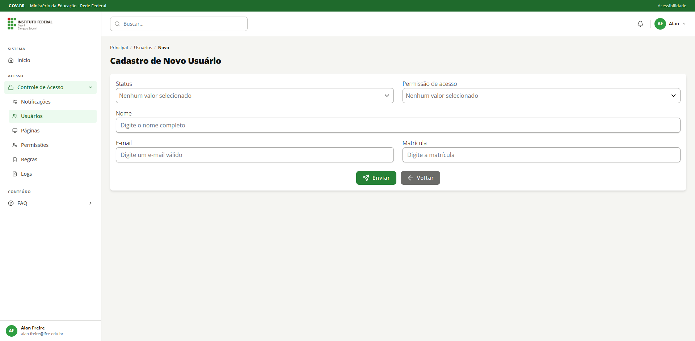

#### Páginas

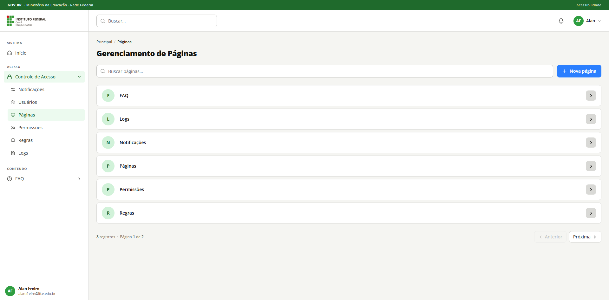

#### 🔑 Gerenciamento de Permissões

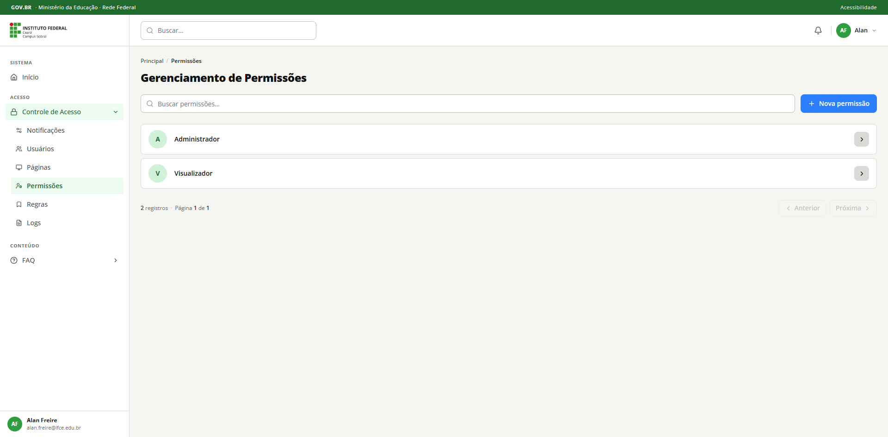

#### Regras

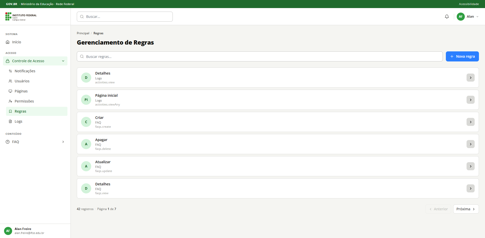

#### 📊 Logs

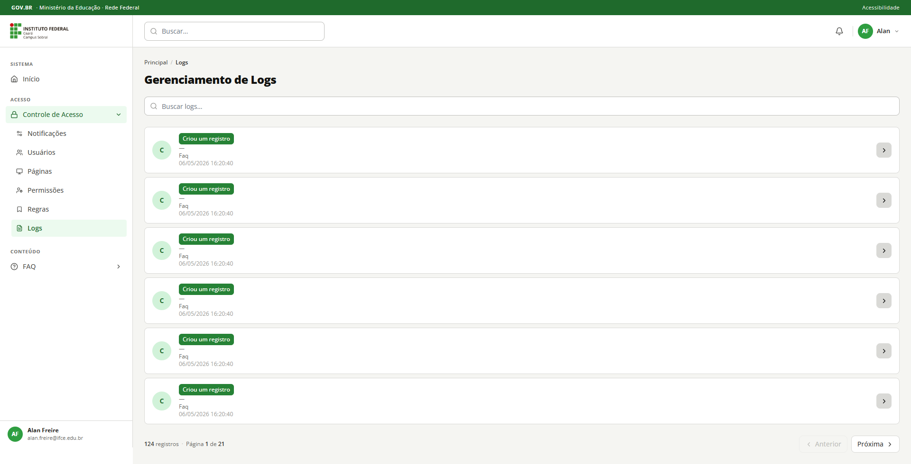

#### 🔐 Login

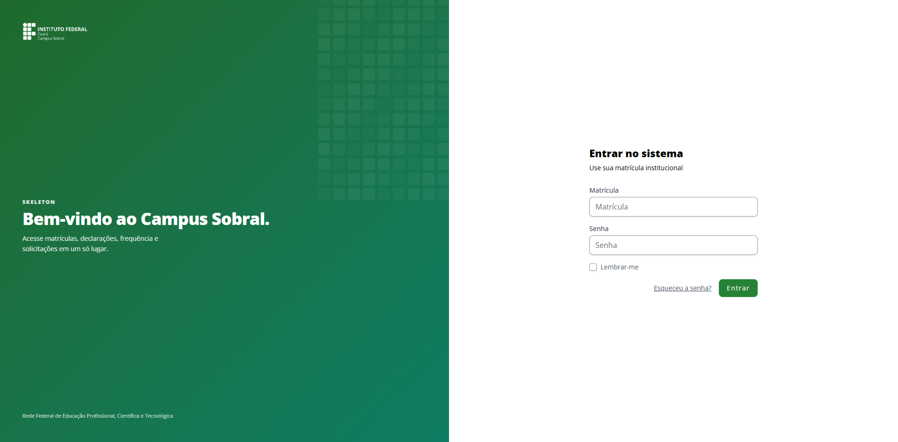

> **Nota**: A permissão "Administrador" possui acesso a todas as funcionalidades por padrão, sem necessidade de atribuição individual de regras.

## PACKAGES PRINCIPAIS

### Frontend (Node.js/NPM)

| Package | Versão | Descrição |
|---------|--------|-----------|
| **react** | ^19.2.5 | Biblioteca UI declarativa |
| **@inertiajs/react** | ^3.0.3 | Adaptador Inertia para React |
| **tailwindcss** | ^4.2.4 | Framework CSS utilitário |
| **@headlessui/react** | ^2.2.10 | Componentes UI headless acessíveis |
| **@tiptap/react** | ^3.22.5 | Editor de texto rico |
| **lucide-react** | ^0.511.0 | Ícones SVG reutilizáveis |
| **tailwind-merge** | ^3.5.0 | Merge inteligente de classes Tailwind |
| **vite** | ^8.0.10 | Build tool e dev server |
| **laravel-vite-plugin** | ^3.0.1 | Integração Laravel com Vite |
| **axios** | ^1.15.2 | Client HTTP |

### Backend (Composer/PHP)

| Package | Versão | Descrição |
|---------|--------|-----------|
| **laravel/framework** | ^13.0 | Framework PHP moderno |
| **laravel/sanctum** | ^4.0 | Autenticação com tokens |
| **inertiajs/inertia-laravel** | ^3.0 | Adaptador Inertia para Laravel |
| **spatie/laravel-activitylog** | ^4.8 | Auditoria e logging de ações |
| **tightenco/ziggy** | ^2.0 | Helpers de rotas em JavaScript |
| **directorytree/ldaprecord-laravel** | ^4.0 | Integração com Active Directory/LDAP |
| **laravel/tinker** | ^3.0 | Console PHP interativo |
| **laravel/sail** | ^1.26 | Environment Docker pré-configurado |
| **laravel/pail** | ^1.2.2 | Logs em tempo real |
| **laravel/pint** | ^1.13 | Formatação de código PHP |
| **laravel/breeze** | ^2.1 | Scaffolding de autenticação |

## CONFIGURAÇÃO AVANÇADA

### Variáveis de Ambiente Importantes

```env
# Aplicação
APP_NAME="Skeleton IFCE"
APP_URL=http://localhost

# Banco de Dados
DB_CONNECTION=mariadb
DB_HOST=mariadb
DB_PORT=3306
DB_DATABASE=skeleton
DB_USERNAME=root
DB_PASSWORD=

# Cache
CACHE_DRIVER=redis
SESSION_DRIVER=cookie
QUEUE_CONNECTION=redis

# Mail
MAIL_MAILER=smtp
MAIL_HOST=mailhog
MAIL_PORT=1025

# Paginação
APP_PAGINATION=15

# LDAP / Active Directory
LDAP_CONNECTION=default
LDAP_CONNECTIONS=default
LDAP_DEFAULT_HOSTS=ad.ifce.edu.br
LDAP_DEFAULT_USERNAME=
LDAP_DEFAULT_PASSWORD=
LDAP_DEFAULT_PORT=389
LDAP_DEFAULT_BASE_DN="OU=DG-SOB,OU=IFCE,DC=ad,DC=ifce,DC=edu,DC=br"
LDAP_DEFAULT_TIMEOUT=5
LDAP_DEFAULT_SSL=false
LDAP_DEFAULT_TLS=false
```

> **Nota LDAP:** O sistema autentica via bind direto com as credenciais do usuário (matrícula@ad.ifce.edu.br), sem necessidade de conta de serviço. As credenciais `LDAP_DEFAULT_USERNAME`/`PASSWORD` são opcionais — se vazias, a conexão inicial é anônima.

### Testar Conexão LDAP

```sh
sail artisan ldap:test
```

### Customização de Regras de Autorização

Para adicionar novas regras no sistema, edite o seeder e adicione a regra:

1. Crie a regra via `php artisan make:migration` (se necessário)
2. Adicione ao `RuleSeeder` ou via dashboard
3. A regra será automaticamente registrada como Gate no `AuthServiceProvider`

### Logging de Atividades

Os modelos `User`, `Permission`, `Rule`, `Group`, `Activity`, `Faq` e `Tag` implementam logging automático via `spatie/laravel-activitylog`. Apenas mudanças reais (dirty fields) em campos especificados são registradas.

## TESTES

A aplicação inclui testes com PHPUnit. Para adicionar testes:

```sh
# Criar nova classe de teste
php artisan make:test UserControllerTest

# Executar testes
composer test

# Testes com coverage
php artisan test --coverage

# Teste específico
php artisan test tests/Feature/UserControllerTest.php
```

## DEPLOYMENT

### Produção (Docker)

```sh
# Build de produção
npm run build

# Otimização de Composer
composer install --optimize-autoloader --no-dev

# Gerar chave se necessário
php artisan key:generate

# Migrations
php artisan migrate --force
```

### Variáveis Críticas em Produção
- `APP_DEBUG=false`
- `APP_ENV=production`
- `DB_PASSWORD` bem protegida
- `SESSION_SECURE_COOKIES=true` (HTTPS)
- `SESSION_HTTP_ONLY=true`

## TROUBLESHOOTING

### Containers não iniciam
```sh
# Limpar containers e volumes
docker-compose down -v
docker system prune

# Reiniciar
sail up -d
```

### Erro de permissão no vendor
```sh
sail composer install
```

### Vite não compila
```sh
sail npm install
sail npm run dev
```

### Banco de dados não conecta
```sh
# Verificar containers rodando
docker ps

# Reiniciar MySQL
sail restart mysql

# Testar conexão
sail artisan tinker
```

## DOCUMENTAÇÃO ADICIONAL

- [Documentação Laravel](https://laravel.com/docs)
- [Documentação Inertia.js](https://inertiajs.com)
- [Documentação React](https://react.dev)
- [Documentação Tailwind CSS](https://tailwindcss.com)
- [Documentação Spatie Activity Log](https://github.com/spatie/laravel-activitylog)
- [Documentação LdapRecord](https://ldaprecord.com/docs/laravel/v4)

## SUPORTE E CONTRIBUIÇÕES

Para dúvidas, sugestões ou bugs, entre em contato com a equipe de desenvolvimento.

## CRÉDITOS

Projeto desenvolvido pela Coordenadoria de Tecnologia da Informação do IFCE - *Campus* Sobral.

## CONTATO

📧 [ti.sobral@ifce.edu.br](mailto:ti.sobral@ifce.edu.br)

## LICENÇA

Este é um software de código aberto licenciado sob a licença do [MIT](https://opensource.org/licenses/MIT).
